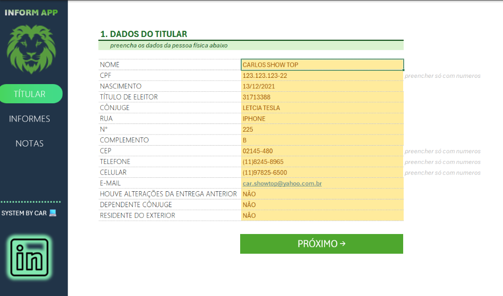
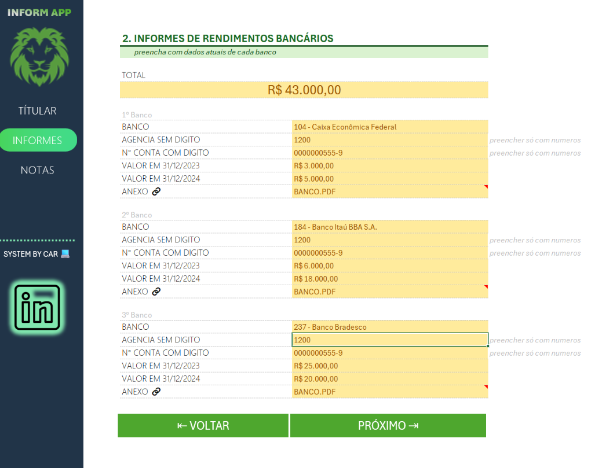
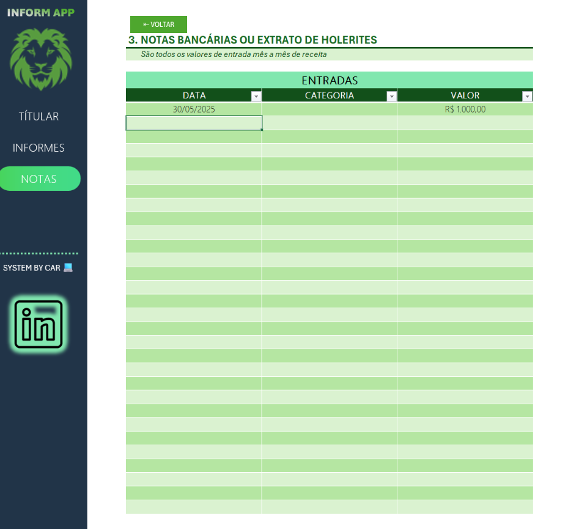

Este projeto tem como objetivo facilitar o gerenciamento e análise de dados utilizando o app **informs_APP.xlsm** que foi todo desenvolvido em Excel. Abaixo estão detalhadas as principais funcionalidades, estrutura e exemplos de preenchimento do APP, serve para facilitar o envio dos dados para o contador ou para proprio uso e controle de informações antes de preencher o documento oficial da receita federal. Todos os botões são navegaveis indo para aba seguinte ou voltando aba anterior quanto navegar pelo menu lateral indo até a aba de preferência. 

## Estrutura do APP

O APP **informs_APP.xlsm** é composta por diversas abas, cada uma com uma finalidade específica:

### 1. **DADOS DO TITULAR**
- **Campos:**  
    - `NOME`: Nome  
    - `CPF`: Cpf  
    - `Nascimento`: Data de nascimento  

#### Exemplo: Aba **DADOS DO TITULAR**

| NOME         | CPF         | Nascimento  | Etc                        |
|--------------|-------------|-------------|----------------------------|
| João Silva   | 123.456.789-00 | 01/01/1980  | Endereço, Telefone, Email  |
| Maria Souza  | 987.654.321-00 | 15/05/1975  | Endereço, Telefone, Email  |    

  

### 2. **INFORMES**
- **Campos**  
    - `Bancos`: Banco  
    - `Agencia`: Agencia  
    - `Conta`: N° da Conta 
    - `Valor`: Valor do ano anterior  
    - `Valor`: Valor Atual 

#### Exemplo: Aba **INFORMES**

| Bancos      | Agencia | Conta      | Valor (Ano Anterior) | Valor Atual |
|-------------|---------|------------|----------------------|-------------|
| Banco ABC   | 1234    | 56789-0    | R$ 10.000,00         | R$ 12.500,00|
| Banco XYZ   | 4321    | 98765-1    | R$ 5.000,00          | R$ 6.200,00 |    

      

### 3. **Notas**
- Nesta aba inserir as notas caso Pessoa Juridica ou caso CLT inserir os valores recebidos pelas pessoas juridica em caso de CLT-Pessoa Física.

#### Exemplo: Aba **Notas**

| Tipo de Nota      | Valor Recebido | Observações                        |
|-------------------|----------------|------------------------------------|
| Pessoa Jurídica   | R$ 2.000,00    | Serviços prestados PJ              |
| CLT - Pessoa Física | R$ 3.500,00  | Salário referente a maio/2024      |

  

## Observações Importantes

- **Macros:** Certifique-se de habilitar macros ao abrir a planilha para garantir o funcionamento completo dos relatórios e automações.
- **Backup:** Recomenda-se realizar backups periódicos da planilha para evitar perda de dados.
- **Personalização:** As abas e campos podem ser adaptados conforme a necessidade do projeto ou equipe, porem algumas edições estão bloqueadas para que não desconfigure o funcionamento do APP.

## Suporte

Para dúvidas ou sugestões, entre em contato com o responsável pelo projeto atraves do link abaixo ou no proprio app clicando no icone do linkedln.

[Carlos Lopes](https://www.linkedin.com/in/clmoura/)

